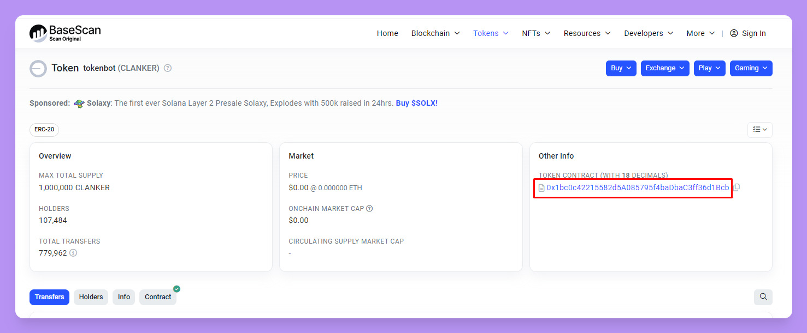
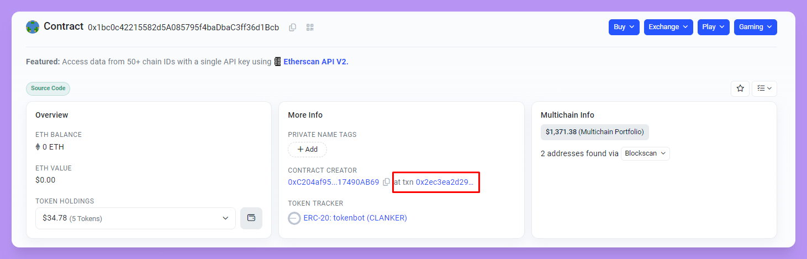
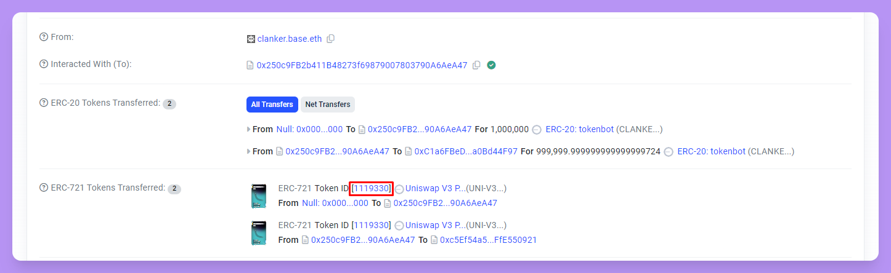

# Unclaimed Rewards Balance

If you've deployed a token with Clanker that has been traded at least once, you have earned rewards.

You can check the balance of unclaimed rewards that you've accrued by looking up the balance of `Unclaimed Fees` on the initial LP of your token.

1. Go to your token's page on <https://www.clanker.world/clanker> and select `BaseScan`

   <figure><figcaption></figcaption></figure>
2. Click on the contract address for the token's contract

   <figure><figcaption></figcaption></figure>
3. Click on the contract creation transaction

   <figure><figcaption></figcaption></figure>
4. Obtain the `Token ID` for the LP

   <figure><figcaption></figcaption></figure>
5. Visit [`https://app.uniswap.org/positions/v3/base/[YOUR TOKEN ID HERE]`](https://app.uniswap.org/positions/v3/base/1119330) and replace the bracketed section with your `Token ID` from the previous step.&#x20;
6. 40% of the `Uncollected fees` is the current unclaimed rewards balance that token creators can claim. Please note that the dollar values of the rewards is an estimate and will fluctuate along with the prices of the underlying tokens in the pool, $CLANKER and $WETH in this case.\
   \
   Using $CLANKER as an example, the creator could claim:\
   \
   148.28 $CLANKER \* 40% = **\~59.312 $CLANKER** in creator rewards\
   3.73 $WETH \* 40% = **\~1.492 $WETH** in creator rewards

   <figure><figcaption></figcaption></figure>
7. Please see [FAQ](faq.md) for detail on claiming creator rewards.
