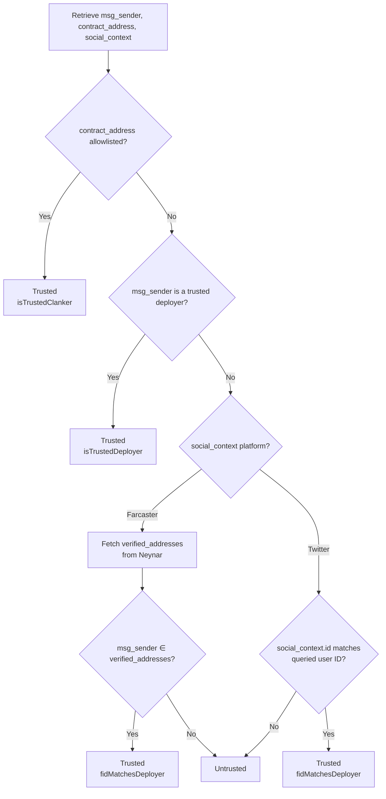

# Verifying the Social Context of Token Deploys

`msg_sender ∈ verifiedAddresses`

A match indicates the same person controls both the Farcaster account and the wallet.

4. **Twitter Context Match — Twitter**

For Twitter tokens, confirm that `social_context.id` matches the queried Twitter user ID. This is weaker than Farcaster verification.

## Verification Flow



## Using the API

```bash
curl "https://clanker.world/api/search-creator?q=dish"
```

Each `tokens` entry includes `trustStatus`:

| Field                | Type       | Meaning                                                                          |
| -------------------- | ---------- | -------------------------------------------------------------------------------- |
| `isTrustedClanker`   | `boolean`  | Contract is manually allowlisted.                                                |
| `isTrustedDeployer`  | `boolean`  | `msg_sender` is a vetted deployer.                                               |
| `fidMatchesDeployer` | `boolean`  | `msg_sender` is in the FID's verified addresses (or Twitter match).              |
| `verifiedAddresses`  | `string[]` | Farcaster verified addresses considered during the check.                        |

To filter for verified results, use `trustedOnly=true`:

```bash
curl "https://clanker.world/api/search-creator?q=alice&trustedOnly=true"
```

This returns tokens where at least one of `isTrustedClanker`, `isTrustedDeployer`, or `fidMatchesDeployer` is true.

## Checking a Single Token

To independently verify a token's creator:

1. Retrieve `msg_sender`, `contract_address`, and `social_context`.
2. Accept if `contract_address` is allowlisted.
3. Accept if `msg_sender` is trusted.
4. For Farcaster context:
   * Get user with FID from Neynar.
   * Compare `msg_sender` with `verified_addresses`.
   * A match proves ownership.
5. For Twitter context:
   * Confirm user ID matches `social_context.id`.

```typescript
async function isFarcasterVerifiedDeploy({
  msgSender,
  socialContext,
}: {
  msgSender: string;
  socialContext: { platform: 'farcaster'; id: string };
}) {
  const fid = Number(socialContext.id);
  if (!fid) return false;
​
  const res = await fetch(
    `https://api.neynar.com/v2/farcaster/user/bulk?fids=${fid}`,
    { headers: { 'x-api-key': process.env.NEYNAR_API_KEY! } },
  );
  const { users } = await res.json();
  const verified: string[] = users?.[0]?.verified_addresses?.eth_addresses ?? [];
​
  return verified.some((addr) => addr.toLowerCase() === msgSender.toLowerCase());
}
```

## What the Trust Check Does NOT Prove

* It does not guarantee the token's economic intent or value.
* A false signal does not imply fraudulence.
* Twitter does not offer on-chain proof like Farcaster; handle Twitter verifications cautiously. Always check the deployment context of X deploys to view the tweet that triggered the deployment. Check the X account for impersonation as well.
* Always accompany the trust status with standard disclaimers: tokens are speculative, conduct your own research, this is not financial advice.

## How to have your Farcaster account show as Creator

You can either clank through the bot in-feed, preclank through the deploy page, or send the `deployToken` method from the deploy page or SDK with an account that is verified to your Farcaster account. To verify an ETH account on your Farcaster profile, go to Settings ⇒ Verified Addresses
