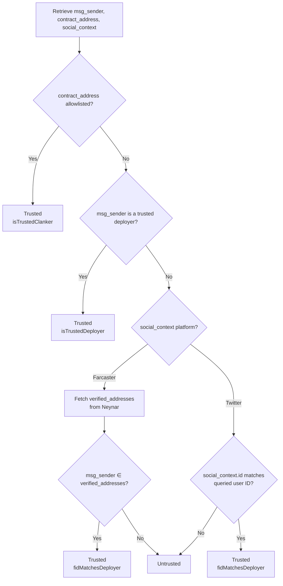

# Verifying the Social Context of Token Deploys

Anyone can deploy a Clanker and attach an arbitrary `social_context` (Farcaster FID, Twitter handle, etc.) to it. The on-chain payload is not authenticated — it's just metadata the deployer chose to embed. To verify a token's claimed creator, check the social context against trusted signals.

This document outlines the trust model used by clanker.world and how to replicate these checks using the public `GET /api/search-creator` endpoint.

## Why This Matters

A token row from `/api/search-creator` looks like:

```json
{
  "contract_address": "0xabc...",
  "msg_sender": "0xdeadbeef...",
  "social_context": {
    "platform": "farcaster",
    "id": "12345"
  },
  "trustStatus": {
    "isTrustedDeployer": false,
    "isTrustedClanker": false,
    "fidMatchesDeployer": true,
    "verifiedAddresses": ["0xdeadbeef..."]
  }
}
```

There are two distinct identities:

* `msg_sender` — the EOA or contract that initiated the on-chain call. This is provable through transaction records.
* `social_context` — a free-form `{ platform, id }` field that the deployment embeds. The deployer might not control the referenced account.

A malicious deployer can claim any FID in `social_context`. The trust check aims to answer: "Is the signatory wallet truly owned by the claimed social account?"

## Trust Signals (in Priority Order)

clanker.world resolves trust using four signals. The first matching one determines trust.

### 1. Allowlisted Clanker (`isTrustedClanker`)

The token's contract address is allowlisted, verified out-of-band (e.g., tokens deployed through Clanker and v3 presale clanker addresses). This signal overrides all others.

### 2. Trusted Deployer (`isTrustedDeployer`)

`msg_sender` is in the vetted deployers list maintained by Clanker or partners. Here is a list of historical TRUSTED\_DEPLOYERS but is subject to be modified/added.

```javascript
// TRUSTED_DEPLOYERS
  '0x2112b8456AC07c15fA31ddf3Bf713E77716fF3F9',
  '0xB2C90e2bB032349e7bEc82B37Cdcc93b6B91036a',
  '0x8da62A828b0D9f1B33F75652605e12ee4E5e4F06',
  '0x002F07B0D63e8ac14F8ef6B73Ccd8caF1FeF074c',
  '0xC204af95b0307162118f7Bc36a91c9717490AB69',
  '0xd9aCd656A5f1B519C9E76a2A6092265A74186e58',
  '0xdd6494902709C8D7DfFf3daca21cF067271f22F8',
  '0xdc7D0Ea3B64E0c74488faF6B2BDc927B875Cd3f2',
  '0x21c78a0350fa50e7c79c761003e33c0c7f440185',
  '0x5e2b5027742ae08c1a018144e31f101f24dc9824',
  '0x72469D86A92f5A9E975fE371a66015E667ab288f',
  '0x8865910d6ca985782Dc9CC521d23a10100fC800B',
  '0xe0c959eedcfd004952441ea4fb4b8f5af424e74b',
  '0x24D514Bc8eF5649A367d9c209b3AF16b0f177026',
  '0x9844050f249604F4485aeD2fC51BAAb3DBe78411',
  '0x26D0A510553C209a584E01Bd4551bDbe38151Fd4', // bracky deployer
  '0xBD01E8106a169687C8572672c8900760E5BA170f', // AutoBoy deployer
```

### 3. FID Verified (`fidMatchesDeployer`) — Farcaster

For Farcaster tokens, clanker.world retrieves the FID's `verified_addresses.eth_addresses` through Neynar to check:

`msg_sender ∈ verifiedAddresses`

A match indicates the same person controls both the Farcaster account and the wallet.

### 4. Twitter Context Match — Twitter

For Twitter tokens, confirm that `social_context.id` matches the queried Twitter user ID. This is weaker than Farcaster verification.

## Verification Flow



## Using the API

```bash
curl "https://clanker.world/api/search-creator?q=dish"
```

Each `tokens` entry includes `trustStatus`:

| Field                | Type       | Meaning                                                                          |
| -------------------- | ---------- | -------------------------------------------------------------------------------- |
| `isTrustedClanker`   | `boolean`  | Contract is manually allowlisted.                                                |
| `isTrustedDeployer`  | `boolean`  | `msg_sender` is a vetted deployer.                                               |
| `fidMatchesDeployer` | `boolean`  | `msg_sender` is in the FID's verified addresses (or Twitter match).              |
| `verifiedAddresses`  | `string[]` | Farcaster verified addresses considered during the check.                        |

To filter for verified results, use `trustedOnly=true`:

```bash
curl "https://clanker.world/api/search-creator?q=alice&trustedOnly=true"
```

This returns tokens where at least one of `isTrustedClanker`, `isTrustedDeployer`, or `fidMatchesDeployer` is true.

## Checking a Single Token

To independently verify a token's creator:

1. Retrieve `msg_sender`, `contract_address`, and `social_context`.
2. Accept if `contract_address` is allowlisted.
3. Accept if `msg_sender` is trusted.
4. For Farcaster context:
   * Get user with FID from Neynar.
   * Compare `msg_sender` with `verified_addresses`.
   * A match proves ownership.
5. For Twitter context:
   * Confirm user ID matches `social_context.id`.

```typescript
async function isFarcasterVerifiedDeploy({
  msgSender,
  socialContext,
}: {
  msgSender: string;
  socialContext: { platform: 'farcaster'; id: string };
}) {
  const fid = Number(socialContext.id);
  if (!fid) return false;
​
  const res = await fetch(
    `https://api.neynar.com/v2/farcaster/user/bulk?fids=${fid}`,
    { headers: { 'x-api-key': process.env.NEYNAR_API_KEY! } },
  );
  const { users } = await res.json();
  const verified: string[] = users?.[0]?.verified_addresses?.eth_addresses ?? [];
​
  return verified.some((addr) => addr.toLowerCase() === msgSender.toLowerCase());
}
```

## What the Trust Check Does NOT Prove

* It does not guarantee the token's economic intent or value.
* A false signal does not imply fraudulence.
* Twitter does not offer on-chain proof like Farcaster; handle Twitter verifications cautiously. Always check the deployment context of X deploys to view the tweet that triggered the deployment. Check the X account for impersonation as well.
* Always accompany the trust status with standard disclaimers: tokens are speculative, conduct your own research, this is not financial advice.

## How to have your Farcaster account show as Creator

You can either clank through the bot in-feed, preclank through the deploy page, or send the `deployToken` method from the deploy page or SDK with an account that is verified to your Farcaster account. To verify an ETH account on your Farcaster profile, go to Settings ⇒ Verified Addresses
