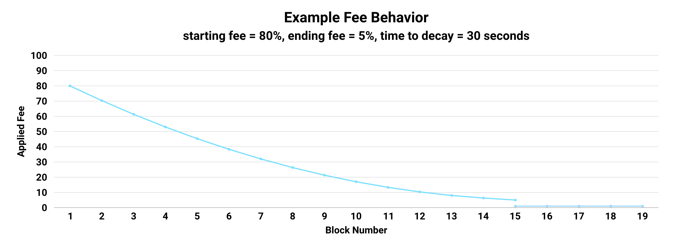

# ClankerMevDescendingFees

**ClankerMevDescendingFees** is a Mev module designed to impose higher fees on snipers. Deployers are able to specify a starting LP fee (up to 80%), an ending fee, and a time to descend (up to 2 minutes). Clanker's initial recommended configuration will start effective fees at 80% and descend to 5% over 30 seconds, after which the pool's normal fee behavior will commence. For the motivation behind these choices, see our [v4 sniper activity writeup](https://paragraph.com/@clankerworld/clanker-v4_1-sniper-tech).

The fees decay following the formula: `fee = endingFee + feeRange * (timeDecay / timeToDecay)²`.

Swaps are able to start in the second after deployment.&#x20;

<figure><figcaption></figcaption></figure>

The fee applied to the swap is the LP's fee plus Clanker's additional 20% fee. Clanker's default starting market cap is $40k USD, and with the proposed starting fee of 80%, we're setting the starting price for snipers at a market cap of $200k.

<figure><figcaption></figcaption></figure>

### Initialization

Token deployers can configure the fee parameters with the following struct:

```solidity
struct FeeConfig {
    uint24 startingFee; // LP fee to start at
    uint24 endingFee; // LP fee to descend to
    uint256 secondsToDecay; // seconds to decay over
}
```

This config is set on the deployment struct as follows:

```solidity
address clankerMevDescendingFees; // address of the deployed MEV module
IClanker.DeploymentConfig memory deploymentConfig;

// setup the MEV module data
IClankerMevDescendingFees.FeeConfig memory feeConfig = IClankerMevDescendingFees.FeeConfig({
    startingFee: 666777, // 66%, 80% applied fee
    endingFee: 50000, // 5%
    secondsToDecay: 30 // 30 seconds
});

deploymentConfig.mevModuleConfig.mevModule = address(clankerMevDescendingFees);
deploymentConfig.mevModuleConfig.mevModuleData = abi.encode(feeConfig);
```
